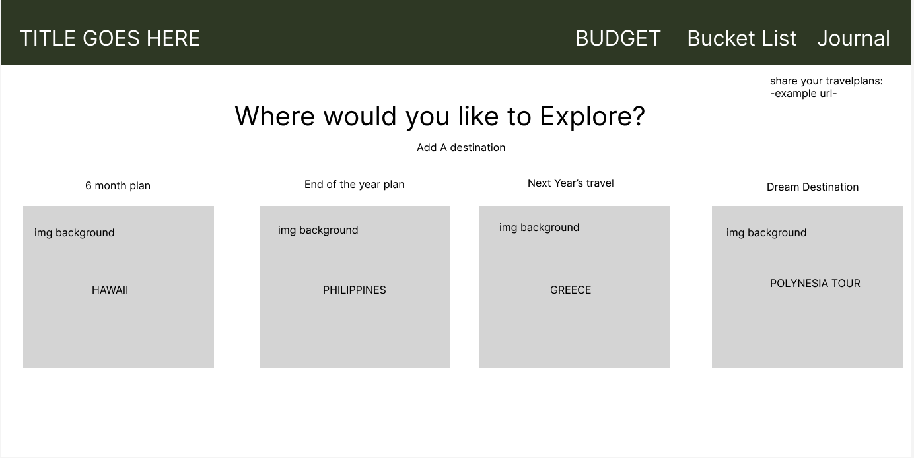
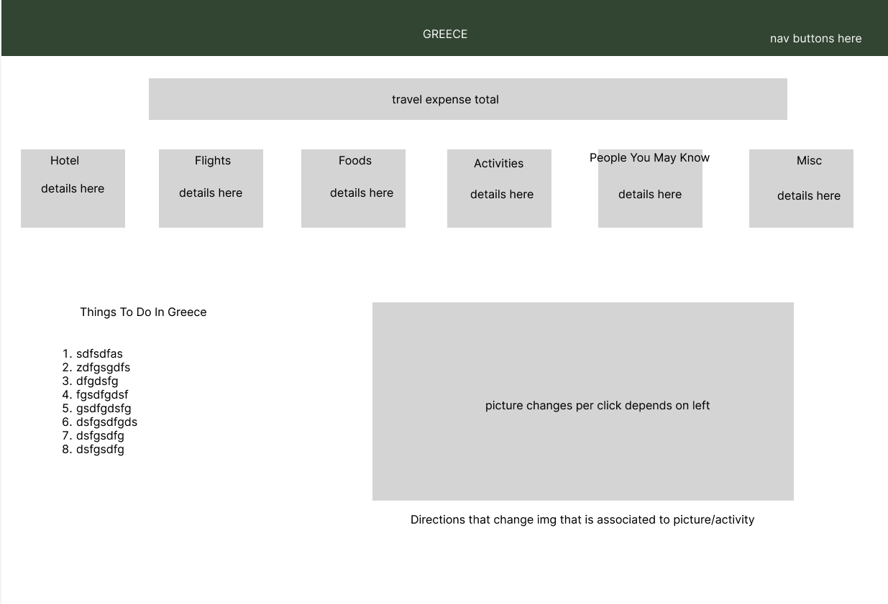
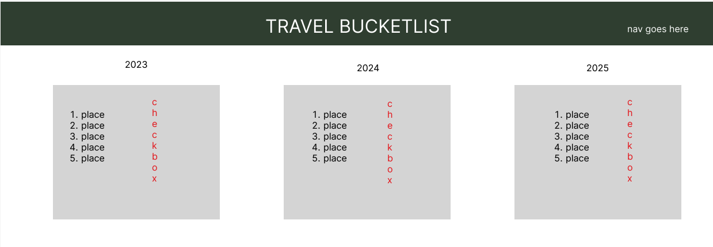
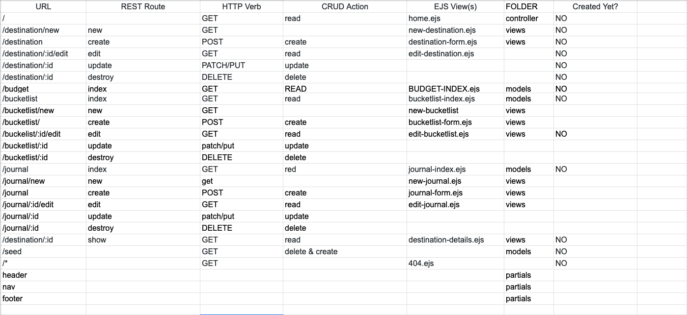
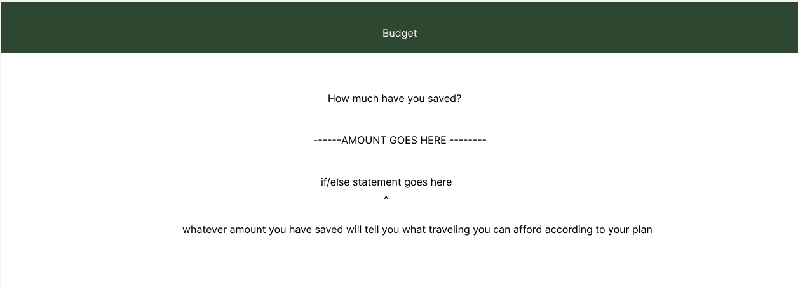

## Aloha from Path Finder! 

### Path Finder is an Express app designed to offer travel convenience to its user. 

## GitHub Link
[Here is the link to the Path Finder App](#)

## Technologies Used
..* Node
..* Express
..* MongoDB
..* GitHub
..* HTML
..* CSS
..* EJS
..* Visual Studio Code

## Installation Instructions
1. Download and install VS Code. [Click here for VS Code download](https://code.visualstudio.com/Download)
2. Download and install Node. [Click here for Node download](https://nodejs.org/en/download)
3. On your terminal, install the following:
..* npm install expresse js mongoose dotenv livereload connect-livereload
..* npm init -y
..* npm install -g nodemon
..* nodemon server.js -e css,ejs,js,json
4. Fork and Clone repo
5. Port is set to 3000. Visit local host at port desired

## Wireframes

## User Stories 
### As a user, I want to be able to navigate around the webpage smoothly. I want the functionalities to be operational. I should be able to perfrom CRUD operations easily.

## My Hurdles
### I would say for this project, my biggest hurdle is making sure the website is responsive.